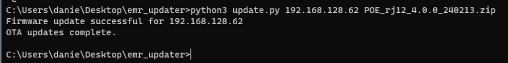

These are tools that enable updates of firmware for Energy Meter Readers that are located on the same network as where the tool is running.

## Windows

.\update_win32.exe ip.txt fw.zip

ip.txt can also be an ip, for example

.\update_win32.exe 192.168.128.26 fw.zip

### Run python scripts on Windows

Install Python3 using Windows app store

Install module "requests" by running below on command line.

    pip install requests

Run the following on the command line

    python3 update.py <ip_address> <firmware_file>

Example below:

## Linux

For linux, use the "update" file:

./update.sh ip.txt fw.zip

or with ip:

./update.sh 192.168.128.26 fw.zip
